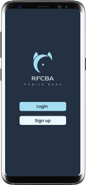
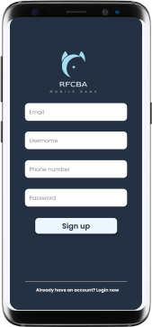
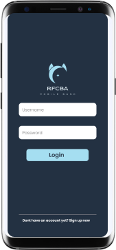
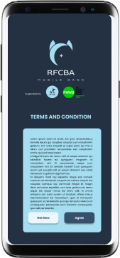
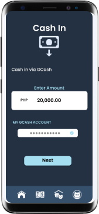

# RFCBA-Mobile-Bank

## Overview
The RFCBA Mobile Bank Application is an android software that can be use on smartphones to facilitate transactions and let users to save money. 
Each user will be able to:

* Create a user savings account. Sign up option is available in the application
* Login the user's existing account
* Provide contact number and email account for security purposes
* Deposit and withdraw money
* Request and transfer money to other contacts
* Send money to other merchants
* Donate to The Philippine Animal Welfare Society, Inc. 

## Compatibility
The RFCBA Mobile Bank Application  user-friendly app is compatible with all mobile devices. Below is a condensed list of compatible devices. 
* Android phones
* Android tablets
* iPhone
* iPad

## Features
### 1. Login and Sign up
The user must complete the relevant fields below after selecting one of the two options.

 

### 2. Terms and Conditions
The terms and condition is also provided by the creator of the application whether the user accept upon installation or not. The user is not forced to download the application and may delete the RFCBA Mobile App anytime they want.

### 3. Home Page
The Dashboard will appear once the Login/Sign Up filled is completed. 
The user can choose any of the options to make a transaction that they need. 

### 4. Cash In and Cash Out
* Cash In

In this page, user may able to deposit the money to the RFCBA Mobile Application to have a balance on its account.

* Cash Out

Withdrawal on this application is possible by just selecting cash out button and filled up all needed information to proceed the transaction.

 

